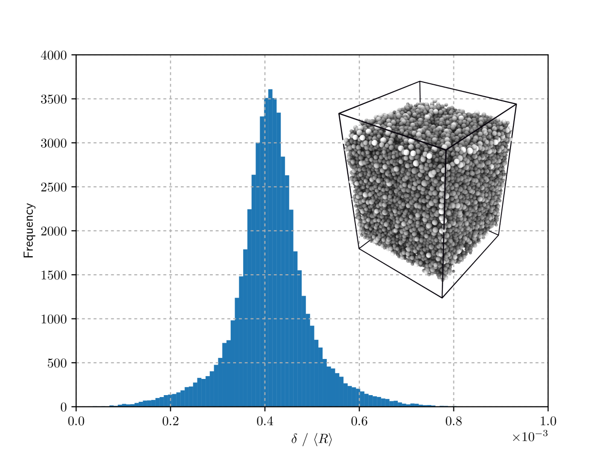
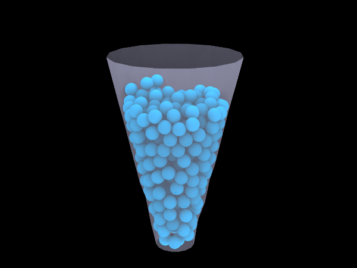

# Welcome to the PyGran webpage!

PyGran is a toolkit primarily designed for analyzing DEM simulation data. In addition to performing basic and advanced post-processing, PyGran enables running DEM simulation with [LIGGGHTS](https://www.cfdem.com/liggghtsr-open-source-discrete-element-method-particle-simulation-code) in Python.

Installing PyGran is quite straight forward on a Unix/Unix-like machine. Just fire up a terminal and run from the PyGran source directory:

```bash
python setup.py install --user
```

Using PyGran is also quite straight forward:

```python
from PyGran import Analyzer
from PyGran.Materials import glass

Gran = Analyzer.System(Particles='granular.dump')
NNS = Analyzer.Neighbors(Gran.Particles, material=glass)
overlaps = NNS.overlaps
```

<p style="text-align:center;"></p>

```python
from PyGran import Simulator
from PyGran.Materials import stearicAcid, steel

pDict = {

	'model': Simulator.models.SpringDashpot,
	'boundary': ('f','f','f'),
	'box':  (-1e-3, 1e-3, -1e-3, 1e-3, 0, 4e-3),

	'SS': ({'insert': 'by_pack', 'material': stearicAcid,'natoms': 1000, \
		'freq': 'once', 'radius': ('constant', 5e-5),}, 
		),
		
	'dt': 1e-6,
	'gravity': (9.81, 0, 0, -1),

	'mesh': {
		'hopper': {'file': 'silo.stl', 'mtype': 'mesh/surface', 'material': steel},
		},
	'stages': {'insertion': 1e4},
}

pDict['model'] = pDict['model'](**pDict)
sim = Simulator.DEM(**pDict['model'].params)
insert = sim.insert('cubic', 1, *('block', pDict['box'])
sim.run(pDict['stages']['insertion'], pDict['dt'])
```

<p style="text-align:center;"></p>
